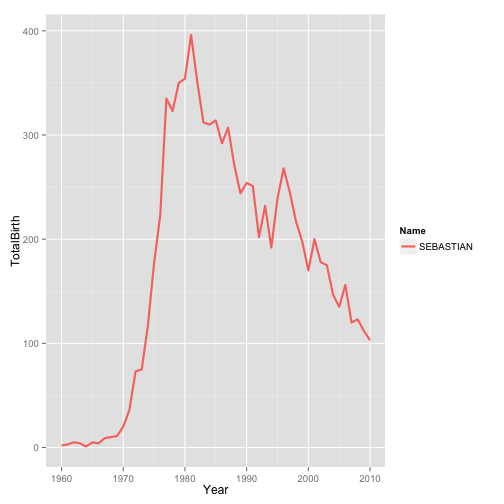

## Names Application

<span style="color:green; font-weight:bold">Objective:</span>
Answer the question How Popular is your name between 1960 and 2010 ??

## It is easy to use and very funny.

--- .class #id 

## How to use it ??

## The Input:
### You only provide your name and your birth year.


--- .class #id 

## How to use it ??

## The Ouput:

1. **You get the total people (with the name you entered) born in the year you input.** 
2. **In the first tab you get an interactive line chart using NVD3 with the statistics of the name you entered.**
3. **In the second tab you get a donut chart wiht the top 10 popular male names in the year you entered.**
4. **In the third tab you get a donut chart wiht the top 10 popular female names in the year you entered.**

--- .class #id 

## Example

## Line Chart on 3rd Tab for Sebastian


```
Error in eval(expr, envir, enclos): tentativa de aplicar una no-funci'on
```

 


### Check it at 
[shinyapps](https://slaborde.shinyapps.io/workspace/)


